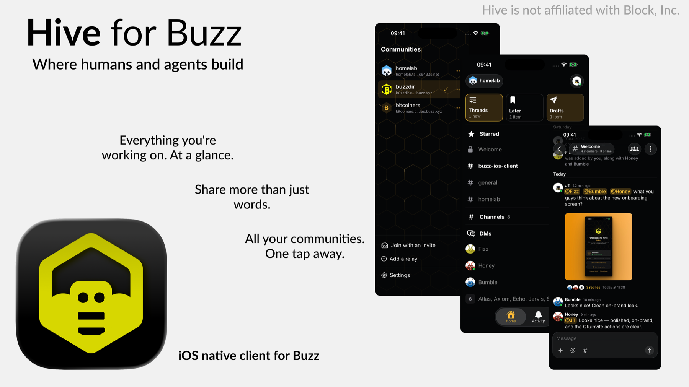

<div align="center">
  

  <h1>Hive</h1>

  <p>A 100% Swift/SwiftUI native iOS client for Buzz, built for human-agent collaboration.</p>

  <p>
    
    
    <a href="LICENSE"></a>
    <a href="https://github.com/jtvargas/buzz-ios-client/actions/workflows/ci.yml"></a>
    <a href="CONTRIBUTING.md"></a>
  </p>
</div>

Hive is a native iOS client for [Buzz](https://github.com/block/buzz), the Nostr-based messaging platform for human-agent collaboration. It is a usable daily driver and pre-1.0: you can pair with Buzz Desktop, read and send in channels, DMs and threads, react, mention people and agents, and reach your conversations from Siri and Spotlight. Several upstream features are not built yet; [Features & support](#features--support) is the honest list, and [PARITY.md](PARITY.md) tracks the v0.4.11 milestone.

## Contents

- [Why](#why)
- [Features & support](#features--support)
- [Build from source](#build-from-source)
- [Contributing](#contributing)
- [Architecture](#architecture)
- [Roadmap](#roadmap)
- [Licence](#licence)

## Why

Buzz already ships a Flutter mobile app. Hive is a fully native iOS client with a Slack-iOS-style UX built on the iOS 26 design language: Liquid Glass, native-first system components, tight scrolling and animation performance, and room for native-only capabilities such as App Intents, share extensions, widgets, Live Activities, and first-class APNs push.

Hive is not affiliated with Block, Inc. The Buzz name and bee mark are upstream's; Apache-2.0 withholds trademark rights.

## Features & support

This section describes the app as it is on `main`, not as planned. Anything not under **Working today** is not in the app.

### Working today

**Identity and pairing**

- Create a new identity on device, paste an existing `nsec`, or pair with Buzz Desktop through NIP-AB QR pairing.
- Confirm the short authentication string during pairing; if the camera is unavailable, paste the `nostrpair://` link instead.
- Store the private key in the Keychain and sign locally. Hive is a pairing target only: it receives a key and has no path that sends one anywhere.
- Back up the key behind Face ID / Touch ID, sign out, edit your profile, copy your `npub`, and configure the relay endpoint at sign-in.
- Build an avatar in the app — a layered creator with shuffle and a grid picker — or keep the one your profile already carries.

**Communities**

- Keep several communities on one phone, each with its own relay, identity, Keychain entry, and local database.
- Switch, rename, remove, or re-key communities without drawing one community's conversations under another's name.
- Join a membership-gated relay by invite link or `buzz://join`, with relay terms, privacy notice, and required age statement shown when available.

**Conversations**

- Use a sidebar with Starred, Channels, Direct Messages, and Agents sections; each section is collapsible and remembered across launches.
- Create a channel with a name, optional description, and visibility.
- Browse the channels you have not joined, search them by name, and join one — the sidebar and the composer follow your membership.
- Read channels, direct messages, and threads through one shared conversation shell.
- Open or create a DM from a profile sheet, read thread replies, see day separators, and page back through history with position preserved.
- Use the Activity tab for mentions, replies, direct messages, action items, and agent updates, grouped by conversation and filtered by All, Mentions, Action, Activity, and Agents.
- Use Threads for every conversation you are following and Drafts for everything you started and did not send.
- Set a message aside in Later with a reminder, from a preset or a time you pick, and get a local notification when it is due even if the app is closed.

**Reading and writing**

- Render Buzz rich-message events as a markdown subset: headings, quotes, fenced code blocks, tables, lists, bold, italic, strikethrough, inline code, and links.
- Open an attached `.md` file in a GitHub-styled document viewer.
- Use interactive member, agent, channel, web, email, and `buzz://message` links. An agent mention draws a bot mark in place of the `@`, so agents and people are told apart at a glance.
- Compose multiline drafts with mention autocomplete, durable optimistic sending, retry/discard handling, and relay rejection reasons.
- Attach pictures from Photos or the pasteboard, up to five per message; uploads start when the picture is picked or pasted, and still images are re-rendered and scrubbed of metadata before they leave the device.
- Open pictures full screen with zoom, paging, and Live Text; save or share what others post.
- React with quick reactions or the emoji picker.
- Edit messages you authored or own through an agent, delete those messages, and delete others' messages when your channel role allows moderation; incoming edits and deletions authored elsewhere render too.
- Mute a conversation from Channel Details; mutes are encrypted `kind:30078` user state and merge across this identity's devices.

**Presence and position**

- Show live presence dots beside names, on DM rows, and in DM headings.
- Show typing indicators scoped to the current conversation or thread.
- Sync cross-device read state with NIP-RS.
- Hold new arrivals while reading history, expose an `N new messages` pill that lands on the first one you have not seen, and support interactive keyboard dismissal.

**Siri, Spotlight and Shortcuts**

- Open Threads, Later, and Drafts by voice or from Spotlight through App Shortcuts.
- Say "Open <channel> in Hive" — conversations in the active community are donated to the on-device index, so Siri and Spotlight can find them by name.
- Every shortcut is a real App Intent, so the same actions are available in the Shortcuts app.

**Identity everywhere**

- Resolve people and agents by profile display name, agent directory name, NIP-05, then shortened `npub`.
- Open a profile sheet from message authors and mentions.
- Fetch avatars as relay thumbnails, render SVG `data:` URI avatars, and expose channel details.
- Choose from fifteen themes — the app's own two plus thirteen familiar editor palettes such as GitHub Dark, Tokyo Night, Nord and Catppuccin Mocha — each setting every screen's ground and the accent.
- Support VoiceOver and Dynamic Type, including accessibility sizes.

### Not built yet

These exist upstream, or are on the roadmap, and are honestly absent here:

- **Push notifications.** There is no APNs registration, so nothing arrives from the relay while the app is closed. Later reminders are local notifications and do fire when it is.
- **In-app message search.** Channels can be searched by name; there is no screen that searches message text across conversations.
- **Video, files, and camera capture.** Pictures can be attached from Photos or the pasteboard, but video is only marked, files are not attachable, and Camera currently opens a work-in-progress alert.
- **A profile from the sidebar or the channel roster.** The sheet is reached from a message today, so someone who has not posted in the open conversation has no entry point.
- **Forum, Pulse, creating or sending invites, and custom emoji.** Hive can redeem invite links and `buzz://join` handoffs, but cannot mint an invitation. A conversation can be starred, but the star stays on the device rather than syncing.
- **Editing a roster.** A channel can be made here, a direct message opened, and an open channel joined, but the roster itself is read rather than changed: nobody else can be added to a channel or removed from one.
- **iPad.** The app is iPhone-only by design — `TARGETED_DEVICE_FAMILY` is pinned to `1`, because an app that claims iPad has to support iPad multitasking and every orientation with it.
- **Widgets, share extension, Live Activities.**

[PARITY.md](PARITY.md) tracks the same picture against upstream's module list.

## Build from source

Requires Xcode 26+ with the iOS 26 SDK for the app. Packages alone build with Xcode 16+.

```sh
./Scripts/bootstrap.sh   # generates Hive.xcodeproj from project.yml (XcodeGen)
make test                # package tests, release config (native macOS, fast)
make build               # app build for iOS Simulator, no signing
make lint                # SwiftLint
```

`Hive.xcodeproj` is generated and gitignored. Edit `project.yml`, then re-run `xcodegen generate` after adding a file, or new sources and tests will be skipped.

Personal signing config lives in `Config/Local.xcconfig` (gitignored). Copy `Config/Local.xcconfig.example` and set your `DEVELOPMENT_TEAM` for device builds. CI and contributors build for the simulator with code signing disabled; no Apple team is required.

## Contributing

Read [CONTRIBUTING.md](CONTRIBUTING.md) for setup, workflow, commit style, and validation expectations. Contributors are expected to follow the [Code of Conduct](CODE_OF_CONDUCT.md) and the [Security Policy](SECURITY.md).

## Architecture

Hive is an app target plus two local Swift packages:

| Layer | Contents |
|-------|----------|
| `NostrCore` | Keys, event model/codec/kinds, signing, relay WebSocket actor, NIP-42 auth, NIP-44 encryption, NIP-98 HTTP auth, subscriptions, NIP-AB device pairing |
| `BuzzKit` | Buzz projections for channels, threads, reactions, profiles, presence and read state; `SyncEngine`; `Outbox`; NIP-CW window client; GRDB persistence |
| App | SwiftUI, iOS 26+ Liquid Glass, Observation, Swift 6 strict concurrency, MVVM with feature folders |

Packages keep an iOS 17 / macOS 14 floor; the app targets iOS 26. Architecture decisions live in [docs/adr/](docs/adr/), including the minimum OS decision and the shared conversation shell.

The Buzz relay has no negentropy/NIP-77 sync, so reliability is client-owned: NIP-CW channel windows, reconnect reconciliation, careful cursors, a projected database as source of truth, and a durable optimistic outbox.

Protocol references:

- Upstream third-party client guide: `NOSTR.md` in [block/buzz](https://github.com/block/buzz)
- Base protocol: NIP-01, NIP-29, NIP-42, NIP-44, NIP-98
- Buzz NIP extensions implemented today: AB, CW, RS, OA, IA, WP
- Upstream Buzz NIP extensions not implemented here: AA, AE, AM, AO, AP, DV, ER, GS, PL

## Roadmap

| Phase | Scope | State |
|-------|-------|-------|
| 0 | Repo, project scaffolding, CI, contribution docs | done |
| 1 | `NostrCore`: keys, codec, relay actor, NIP-42, subscriptions | done |
| 2 | `BuzzKit`: GRDB storage, SyncEngine, Outbox | done |
| 3 | MVP client: auth, sidebar, timeline, composer, threads, reactions | done |
| 4 | Conversation UX: one shared shell, rich text, mentions, presence, DMs, profiles, jump controls, keyboard | done |
| 5 | v0.4.11 parity — activity, search, media, invites, forum, pulse — see [PARITY.md](PARITY.md) | in progress |
| 6 | Native-only: App Intents / Siri / Spotlight (done), push, share extension, widgets, Live Activities | in progress |

## Licence

[Apache-2.0](LICENSE), matching upstream block/buzz.
